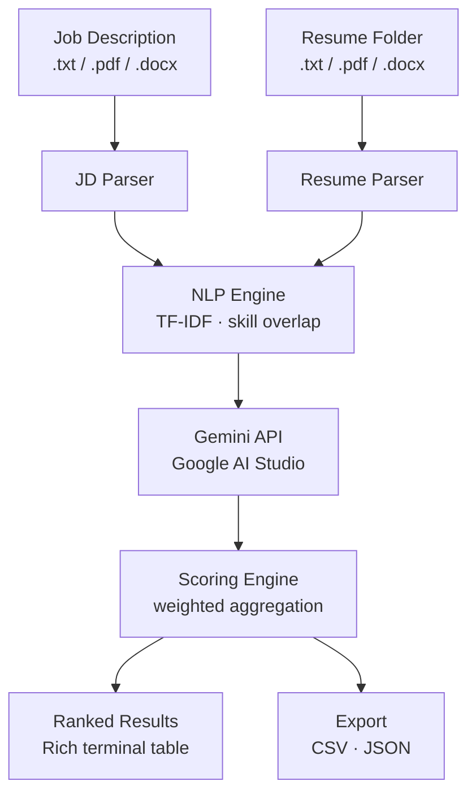

# AI-Powered Resume Screener — Architecture & Roadmap

> **Stack:** Python 3.10+ · PyMuPDF · python-docx · spaCy · scikit-learn · Google AI Studio (Gemini) · pandas · Rich · python-dotenv  
> **Estimated build time:** 17 working days · **Complexity:** 4 / 10

---

## Table of Contents

1. [Project Overview](#1-project-overview)
2. [System Architecture](#2-system-architecture)
3. [Tech Stack](#3-tech-stack)
4. [Component Details](#4-component-details)
5. [Data Schemas](#5-data-schemas)
6. [Directory Structure](#6-directory-structure)
7. [Critical Review & Design Fixes](#7-critical-review--design-fixes)
8. [Development Roadmap](#8-development-roadmap)
9. [Known Limitations & Mitigations](#9-known-limitations--mitigations)
10. [Environment Setup](#10-environment-setup)

---

## 1. Project Overview

An automated HR tool that accepts one job description (JD) and a folder of applicant resumes, extracts and normalises text from each, scores each candidate using a two-layer approach — fast NLP keyword overlap first, then Google Gemini for semantic relevance — and outputs a ranked table to the terminal plus exportable CSV and JSON files.

**What it is not:** a vector-database semantic search engine, a web app, or a real-time system. It is a batch CLI pipeline that runs offline and produces a ranked shortlist.

---

## 2. System Architecture

### 2.1 High-Level Flow



### 2.2 Layer Breakdown

| Layer | Responsibility | Key Output |
|---|---|---|
| **Input** | Accept JD path + resume folder from CLI | Raw file paths |
| **Extraction** | Convert PDF / DOCX / TXT → clean Unicode strings | `(filename, raw_text)` list |
| **Parsing** | Identify skills, keywords, sections from each text | Structured dicts |
| **NLP Engine** | Keyword overlap, TF-IDF cosine similarity | `nlp_score` (0–10) |
| **AI Scoring** | Gemini call with JD + resume → semantic score | `ai_score` (0–10) + rationale |
| **Scoring Engine** | Weighted blend → final rank | Sorted `CandidateResult` list |
| **Output** | Terminal table + CSV/JSON export | Files in `./output/` |

---

## 3. Tech Stack

| Library | Version | Purpose | Why this choice |
|---|---|---|---|
| `PyMuPDF` (fitz) | ≥ 1.23 | PDF text extraction | Fastest pure-Python PDF parser; handles multi-column layouts better than pdfplumber |
| `python-docx` | ≥ 1.1 | DOCX text extraction | Official python-docx; reliable paragraph + table text extraction |
| `spaCy` + `en_core_web_sm` | ≥ 3.7 | Lemmatisation, stop-word removal | Small model, fast, no GPU needed; only using tokeniser + lemmatiser |
| `scikit-learn` | ≥ 1.4 | TF-IDF vectorisation + cosine similarity | Battle-tested; no custom implementation needed |
| `google-generativeai` | ≥ 0.7 | Gemini API calls | Official Google SDK; supports `gemini-1.5-flash` which is cheap and fast |
| `pandas` | ≥ 2.2 | DataFrame manipulation + CSV/JSON export | Clean export API; easy to sort and slice ranking results |
| `Rich` | ≥ 13 | Terminal table + progress bars | Makes CLI output readable without complexity |
| `python-dotenv` | ≥ 1.0 | Load `GOOGLE_API_KEY` from `.env` | Keeps credentials out of code |
| `pytest` | ≥ 8 | Unit and integration tests | Standard; works well with fixtures |

> **Model choice:** Use `gemini-1.5-flash` (default). It is ~10× cheaper than Pro with only marginal quality loss for relevance scoring. Switch to `gemini-1.5-pro` in `config.json` if you need richer rationale text.

---

## 4. Component Details

### 4.1 Text Extractor (`src/extractor.py`)

Accepts a file path and returns a clean UTF-8 string. Dispatches by extension.

- **PDF:** `fitz.open(path)` → iterate pages → `page.get_text("text")` → join with newlines. If result is empty (scanned PDF), log a warning and return empty string — do not crash.
- **DOCX:** Iterate `doc.paragraphs` + rows in `doc.tables` to capture skills listed in table format (common in modern resumes).
- **TXT:** Plain `open(path, encoding="utf-8", errors="replace")` read.
- All outputs go through a single `clean_text()` helper: strip non-printable chars, collapse whitespace, normalise Unicode (NFC).

### 4.2 JD Parser (`src/jd_parser.py`)

Extracts structured information from the job description text.

Outputs a `JDProfile` dataclass:
```
JDProfile
  ├── title: str           # job title (first line / H1 heuristic)
  ├── required_skills: set # matched against skills taxonomy
  ├── keywords: list       # all meaningful tokens after lemmatisation
  └── raw_text: str        # cleaned full text (for AI call)
```

Skills extraction uses a **curated JSON taxonomy** (`data/skills_taxonomy.json`) — a flat list of ~500 tech/domain skills — rather than pure NLP. This gives consistent, deterministic matching. Any token in the JD text that appears in the taxonomy (case-insensitive, lemmatised) is added to `required_skills`.

### 4.3 Resume Parser (`src/resume_parser.py`)

Extracts structured information from each resume.

Outputs a `ResumeProfile` dataclass:
```
ResumeProfile
  ├── filename: str
  ├── candidate_name: str    # first non-empty line heuristic
  ├── skills: set            # skills taxonomy matches
  ├── keywords: list         # all meaningful tokens
  ├── sections: dict         # {"experience": str, "education": str, ...}
  └── raw_text: str          # cleaned full text (for AI call)
```

Section detection uses a **header keyword list** (`SKILLS`, `EXPERIENCE`, `EDUCATION`, `PROJECTS`, `SUMMARY`, etc.) matched case-insensitively against each line. If no headers are found, the full text is used as a single section — this is a deliberate fallback, not a failure mode.

### 4.4 NLP Engine (`src/nlp_engine.py`)

Computes a deterministic skill-overlap score without any API call. Two sub-scores are blended:

1. **Skill set overlap** — Jaccard similarity between `JDProfile.required_skills` and `ResumeProfile.skills`, normalised 0–10.
2. **TF-IDF cosine similarity** — Fit a `TfidfVectorizer` on the JD text + all resume texts combined. Compute cosine similarity between the JD vector and each resume vector, normalised 0–10.

Final `nlp_score = 0.5 × skill_overlap_score + 0.5 × tfidf_score`

> The TF-IDF vectoriser is fit once across the entire batch (not per-resume), which correctly weights terms that are rare across the corpus.

### 4.5 AI Scorer (`src/ai_scorer.py`)

Makes a single Gemini API call per resume. The call is batched with a configurable delay to respect rate limits.

**Prompt structure:**
```
You are an expert HR analyst. Given the job description and resume below,
score the candidate's relevance from 0 to 10 (integer) and provide a one-sentence rationale.

Return ONLY valid JSON in this exact format:
{"score": <int 0-10>, "rationale": "<one sentence>"}

--- JOB DESCRIPTION ---
{jd_text_truncated}

--- RESUME ---
{resume_text_truncated}
```

Both texts are truncated to 2000 characters each before sending to stay well within token limits and reduce cost.

**Caching:** A `cache/scores_cache.json` file stores results keyed by `sha256(jd_text + resume_text)`. If a key exists, the API call is skipped. This means re-running the tool on the same batch is effectively free after the first run.

**Error handling:** If the API returns a non-JSON response or the call fails, `ai_score` defaults to `5.0` (neutral) and `rationale` to `"[API error — manual review required]"`. The pipeline never crashes due to a bad API response.

### 4.6 Scoring Engine (`src/scoring_engine.py`)

Blends the two scores with configurable weights from `config.json`:

```
final_score = (nlp_weight × nlp_score) + (ai_weight × ai_score)
```

Default weights: `nlp_weight = 0.4`, `ai_weight = 0.6`. Results are sorted descending by `final_score`. In case of a tie, alphabetical order by filename is used (deterministic).

### 4.7 Output Module (`src/output.py`)

Two outputs, always both produced:

- **Terminal table** via Rich: columns are Rank, Candidate, NLP Score, AI Score, Final Score, Rationale. Supports `--top N` CLI flag.
- **CSV export** via pandas to `output/results_<timestamp>.csv`.
- **JSON export** to `output/results_<timestamp>.json` (list of result dicts).

---

## 5. Data Schemas

### CLI Input
```
python main.py --jd path/to/job_description.pdf --resumes path/to/resumes/ [--top 10] [--weights nlp=0.4,ai=0.6]
```

### `CandidateResult` (internal, passed between scoring engine → output)
```python
@dataclass
class CandidateResult:
    filename: str
    candidate_name: str
    nlp_score: float        # 0.0 – 10.0
    ai_score: float         # 0.0 – 10.0
    final_score: float      # 0.0 – 10.0
    rationale: str
    skill_matches: set      # skills found in both JD and resume
    skill_gaps: set         # JD skills not found in resume
```

### `config.json`
```json
{
  "model": "gemini-1.5-flash",
  "nlp_weight": 0.4,
  "ai_weight": 0.6,
  "api_delay_seconds": 2,
  "jd_max_chars": 2000,
  "resume_max_chars": 2000,
  "tfidf_max_features": 500
}
```

---

## 6. Directory Structure

```
resume_screener/
├── main.py                       # CLI entry point (argparse)
├── config.json                   # weights, model, rate-limit settings
├── requirements.txt
├── .env                          # GOOGLE_API_KEY=... (gitignored)
├── .gitignore
│
├── src/
│   ├── __init__.py
│   ├── extractor.py              # PDF / DOCX / TXT → clean text
│   ├── jd_parser.py              # JD → JDProfile dataclass
│   ├── resume_parser.py          # resume text → ResumeProfile dataclass
│   ├── nlp_engine.py             # TF-IDF + skill overlap → nlp_score
│   ├── ai_scorer.py              # Gemini API → ai_score + rationale
│   ├── scoring_engine.py         # weighted blend + sort → ranked list
│   └── output.py                 # Rich table + CSV/JSON export
│
├── data/
│   └── skills_taxonomy.json      # ~500 curated tech/domain skills
│
├── cache/
│   └── scores_cache.json         # auto-generated; add to .gitignore
│
├── output/                       # auto-generated export files
│
└── tests/
    ├── unit/
    │   ├── test_extractor.py
    │   ├── test_parsers.py
    │   ├── test_nlp_engine.py
    │   ├── test_ai_scorer.py
    │   └── test_scoring_engine.py
    ├── integration/
    │   ├── test_pipeline_parse.py  # phase 1+2 integration
    │   ├── test_pipeline_score.py  # phase 3 integration (mocked API)
    │   └── test_pipeline_e2e.py    # full end-to-end
    └── fixtures/
        ├── sample_jd.txt
        ├── resumes/                # 10 sample resumes of varied formats
        └── expected/
            └── expected_top3.json
```

---

## 7. Critical Review & Design Fixes

This section documents issues found in the first-pass architecture and the fixes applied.

### Fix 1 — Cache key was JD-agnostic (bug)

**Problem:** Hashing only the resume text means the same resume always returns the same cached score regardless of which JD is being used. This is wrong — a Python developer resume should score differently against a DevOps JD vs a data science JD.

**Fix:** Cache key = `sha256(jd_text + resume_text)`. Both inputs are included in the hash.

### Fix 2 — Score normalization mismatch

**Problem:** Keyword overlap (Jaccard) produces a ratio in `[0.0, 1.0]`. The AI score is `[0, 10]`. Blending these directly would make the NLP score almost invisible (max contribution of 0.4 when the AI score contributes up to 6.0).

**Fix:** Normalise the Jaccard score to `[0, 10]` before blending: `nlp_score = jaccard × 10`. Both scores are now on the same scale before the weighted sum.

### Fix 3 — No rate-limit handling for Gemini API

**Problem:** Sending 20+ resumes in a tight loop will hit Google AI Studio's free-tier rate limit (15 requests per minute for Flash). The pipeline would start throwing 429 errors mid-batch.

**Fix:** Add a configurable `api_delay_seconds` (default: 2) sleep between API calls in `ai_scorer.py`. Also wrap each call in a retry loop with exponential backoff (max 3 retries) before falling back to the neutral score.

### Fix 4 — Section detection failure mode

**Problem:** Many resumes — particularly those generated from Canva or LinkedIn exports — use non-standard or no section headers at all. Regex-based section detection would return empty sections and degrade scoring.

**Fix:** Section detection is opportunistic, not required. If no known headers are found, the entire cleaned text is used as the resume content for both NLP and AI scoring. The pipeline does not fail or penalise headerless resumes.

### Fix 5 — Scanned PDF produces empty string

**Problem:** PyMuPDF returns an empty string for image-only PDFs (scanned documents). The pipeline would silently score them as 0 across the board, which is misleading.

**Fix:** After extraction, check if `len(text.strip()) < 50`. If so, log a clear warning: `⚠ [filename] appears to be a scanned PDF — text extraction failed. Skipping.` The candidate is excluded from results with an explanatory note rather than being ranked last.

### Fix 6 — JD too long for prompt context window

**Problem:** Some enterprise JDs are 3,000–5,000 words. Concatenating a full JD with a full resume in a single prompt approaches Gemini's practical useful context and inflates costs.

**Fix:** Both JD and resume text are truncated to `jd_max_chars` / `resume_max_chars` (default 2000 each) before the API call. The truncation happens at the last sentence boundary (`.`) within the character limit to avoid cutting mid-sentence. The full text is still used for NLP scoring.

### Fix 7 — TF-IDF vectoriser must be fit on full corpus

**Problem:** If TF-IDF is fit separately for each JD–resume pair, the term weights are meaningless (every word is equally rare when there are only 2 documents).

**Fix:** Fit the vectoriser once on the combined corpus: `[jd_text] + [r.raw_text for r in all_resumes]`. The JD vector and all resume vectors are then extracted from this shared fitted vectoriser, giving meaningful IDF weights.

---

## 8. Development Roadmap

### Phase 1 — Foundation (Days 1–4)

**Goal:** A working CLI that can load files and produce clean text from any supported format.

#### Subphases

| ID | Task |
|---|---|
| 1.1 | Initialise repo, create `requirements.txt`, set up `.env` + `.gitignore`, install all dependencies |
| 1.2 | Build `extractor.py`: PDF (PyMuPDF), DOCX (python-docx), TXT fallback + `clean_text()` helper |
| 1.3 | Build `main.py` CLI skeleton with argparse: `--jd`, `--resumes`, `--top`, `--output` flags |
| 1.4 | Populate `data/skills_taxonomy.json` with ~500 tech/domain skills (can seed from online lists) |

#### Testing

**Unit tests (`tests/unit/test_extractor.py`):**
- `test_pdf_extraction` — extract from a known text-PDF fixture; assert output contains expected keywords
- `test_docx_extraction` — extract from a fixture DOCX; assert paragraphs and table cells both present
- `test_txt_extraction` — plain text round-trip; assert output equals cleaned input
- `test_scanned_pdf_warning` — pass an image-only PDF; assert warning logged + empty string returned
- `test_clean_text_strips_noise` — pass string with control chars; assert they are removed

**Integration test (`tests/integration/test_pipeline_parse.py`):**
- Load the `tests/fixtures/resumes/` folder via CLI args; assert a list of 10 `(filename, text)` tuples is returned with no exceptions

---

### Phase 2 — NLP Processing (Days 5–9)

**Goal:** Structured extraction from JD and resumes, plus a deterministic NLP score that works without any API call.

#### Subphases

| ID | Task |
|---|---|
| 2.1 | Build `jd_parser.py`: produce `JDProfile` with `required_skills`, `keywords`, `raw_text` |
| 2.2 | Build `resume_parser.py`: produce `ResumeProfile` with `skills`, `sections`, `candidate_name`, `raw_text` |
| 2.3 | Build `nlp_engine.py`: TF-IDF corpus fit, cosine similarity, Jaccard skill overlap, blend to `nlp_score` (0–10) |
| 2.4 | Wire phases 1 + 2 together in `main.py`; print parsed JD profile + per-resume NLP scores to console |

#### Testing

**Unit tests (`tests/unit/test_parsers.py`):**
- `test_jd_parser_extracts_known_skills` — fixture JD with explicit skill list; assert all appear in `required_skills`
- `test_jd_parser_unknown_jd` — fixture JD with no taxonomy matches; assert `required_skills` is empty set, not an error
- `test_resume_parser_sections` — fixture resume with standard headers; assert `sections` dict has expected keys
- `test_resume_parser_no_headers` — fixture resume with no headers; assert `raw_text` is used and no exception raised
- `test_candidate_name_extraction` — assert first non-empty line is returned as `candidate_name`

**Unit tests (`tests/unit/test_nlp_engine.py`):**
- `test_nlp_score_range` — assert `nlp_score` is always in `[0.0, 10.0]`
- `test_perfect_overlap` — identical JD and resume skills; assert `nlp_score` is 10.0
- `test_zero_overlap` — disjoint skill sets; assert `nlp_score` is 0.0
- `test_tfidf_fit_on_corpus` — verify vectoriser is fit on combined corpus, not per-pair
- `test_score_normalization` — Jaccard score of 0.5 must produce `skill_overlap_score` of 5.0

**Integration test (`tests/integration/test_pipeline_parse.py`):**
- Full fixture batch (1 JD + 10 resumes) → assert all 10 `ResumeProfile` objects + all 10 `nlp_score` values produced with no exceptions

---

### Phase 3 — AI Scoring (Days 10–13)

**Goal:** A reliable Gemini integration that enriches each candidate with a semantic score and rationale, with caching and graceful error handling.

#### Subphases

| ID | Task |
|---|---|
| 3.1 | Build `ai_scorer.py`: Gemini SDK setup, prompt template, truncation logic, JSON response parsing |
| 3.2 | Add caching: `cache/scores_cache.json`, key = `sha256(jd_text + resume_text)` |
| 3.3 | Add rate limiting: configurable `api_delay_seconds` sleep + 3-retry exponential backoff |
| 3.4 | Add neutral fallback: if API fails after retries, return `{score: 5, rationale: "[API error]"}` |

#### Testing

**Unit tests (`tests/unit/test_ai_scorer.py`):**
- `test_parse_valid_json_response` — pass well-formed JSON string; assert correct `ai_score` and `rationale` extracted
- `test_parse_malformed_response` — pass non-JSON string; assert fallback `score=5` and error rationale returned
- `test_cache_hit_skips_api` — prime cache with a known key; assert API is not called on second invocation (mock the SDK)
- `test_cache_key_includes_jd` — same resume text, different JD text; assert different cache keys produced
- `test_text_truncation` — pass a 5000-char text; assert truncated to configured max at sentence boundary
- `test_api_retry_on_failure` — mock API to fail twice then succeed; assert 3rd call succeeds and result returned

**Integration test (`tests/integration/test_pipeline_score.py`):**
- Mock the Gemini SDK client; feed 1 JD + 1 resume; assert full `{score, rationale}` dict returned
- Assert cache file is written after the call

---

### Phase 4 — Ranking & Output (Days 14–17)

**Goal:** Complete end-to-end pipeline producing a ranked terminal table and exportable files.

#### Subphases

| ID | Task |
|---|---|
| 4.1 | Build `scoring_engine.py`: weighted blend from `config.json`, sort descending, return `CandidateResult` list |
| 4.2 | Build `output.py`: Rich table with colour-coded score column; `--top N` support |
| 4.3 | Add CSV + JSON export to `output/` directory via pandas; include timestamp in filename |
| 4.4 | Final wiring in `main.py`: connect all modules; show Rich progress bar during AI scoring step |
| 4.5 | Write `README.md` with install steps, usage examples, and sample output screenshot |

#### Testing

**Unit tests (`tests/unit/test_scoring_engine.py`):**
- `test_weighted_blend_correct` — known `nlp_score` + `ai_score` + weights; assert `final_score` is mathematically correct
- `test_sort_order` — 5 candidates with known scores; assert returned list is sorted descending
- `test_tie_breaking` — two candidates with identical `final_score`; assert alphabetical order
- `test_single_candidate` — list of 1; assert no crash and correct rank of 1
- `test_zero_scores` — all scores 0; assert 10.0 and 0.0 not switched; ranking still valid

**Integration test (`tests/integration/test_pipeline_e2e.py`) — End-to-End:**
- Load fixtures: `sample_jd.txt` + `tests/fixtures/resumes/` (10 files of mixed formats)
- Run full pipeline with mocked Gemini (to avoid real API cost in CI)
- Assert: 10 `CandidateResult` objects produced
- Assert: top-3 candidate filenames match `expected/expected_top3.json`
- Assert: CSV file written to `output/` with correct columns
- Assert: JSON file written and valid
- Assert: no exception raised for any resume in the batch

---

## 9. Known Limitations & Mitigations

| Limitation | Impact | Mitigation |
|---|---|---|
| Scanned / image PDFs return no text | Candidate silently dropped | Clear warning logged; candidate excluded with note in output |
| Skills taxonomy is static | New skills (e.g. a new framework) not matched | Taxonomy file is editable JSON; add skills before a run |
| Gemini truncates long JDs/resumes to 2000 chars | Some context lost in AI scoring | NLP engine still uses full text; AI scoring loss is marginal for most documents |
| Free-tier rate limit (15 RPM) | Slow for large batches | 2-second delay between calls; 50-resume batch takes ~2 minutes |
| Section detection is heuristic | Misclassified sections on unusual layouts | Full-text fallback always active; impact is low since AI scorer reads full text anyway |
| No OCR support | Image-only resumes excluded | Acceptable tradeoff; adding `pytesseract` later is a drop-in swap in `extractor.py` |
| Gemini API key required | Cannot run without internet + key | Cache means subsequent runs are offline-capable for already-scored batches |

---

## 10. Environment Setup

### Prerequisites
- Python 3.10 or higher
- A Google AI Studio API key — get one free at [aistudio.google.com](https://aistudio.google.com)

### Install

```bash
git clone <your-repo>
cd resume_screener
python -m venv venv
source venv/bin/activate       # Windows: venv\Scripts\activate
pip install -r requirements.txt
python -m spacy download en_core_web_sm
```

### Configure

```bash
# Create .env file
echo "GOOGLE_API_KEY=your_key_here" > .env
```

Edit `config.json` to adjust model, weights, or rate-limit delay as needed.

### Run

```bash
# Basic usage
python main.py --jd data/example_jd.pdf --resumes data/resumes/

# Show only top 5 candidates
python main.py --jd data/example_jd.txt --resumes data/resumes/ --top 5

# Override weights at runtime
python main.py --jd data/example_jd.docx --resumes data/resumes/ --weights nlp=0.3,ai=0.7
```

### Run Tests

```bash
pytest tests/unit/ -v                      # fast, no API calls
pytest tests/integration/ -v              # uses mocked API
pytest tests/ --cov=src --cov-report=term # with coverage report
```

### `requirements.txt`

```
PyMuPDF>=1.23.0
python-docx>=1.1.0
spacy>=3.7.0
scikit-learn>=1.4.0
google-generativeai>=0.7.0
pandas>=2.2.0
rich>=13.0.0
python-dotenv>=1.0.0
pytest>=8.0.0
pytest-cov>=5.0.0
```

---

*Document version 1.0 — covers complete build through Phase 4 Day 17.*
